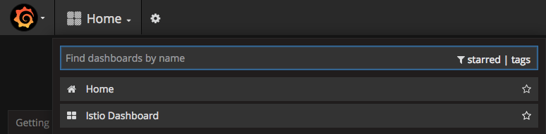
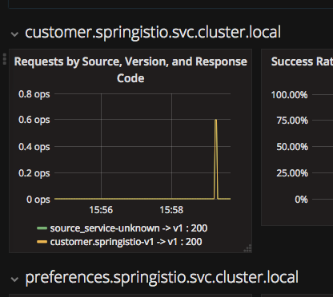

For monitoring, Istio offers out of the box monitoring via Prometheus and Grafana.

## Install Prometheus and Grafana

To make it work, we need first to install [`Prometheus`](https://prometheus.io/) and [`Grafana`](https://grafana.com/). 

Let's go to the istio installation folder.

Execute `cd ~/istio-0.4.0/`{{execute}}

**NOTE**: If you see the following message *-bash: cd: /root/istio-0.4.0/: No such file or directory*, wait a little bit and try again. This happens because the files still being prepared in your environment in the background.

Now we need to apply the following files to the OpenShift instance:

`oc apply -f install/kubernetes/addons/prometheus.yaml -n istio-system`{{execute}}

`oc apply -f install/kubernetes/addons/grafana.yaml -n istio-system`{{execute}}

After the installation of these Istio add-ons, we need to expose the services.

Execute: `oc expose svc prometheus -n istio-system`{{execute}}

and 

`oc expose svc grafana -n istio-system`{{execute}}

Now, let's wait until `grafana` pod is up and running.

Execute `oc get pods -w -n istio-system`{{execute}} and wait until `grafana` pod STATUS is `Running`.

Once it's Running, click `CTRL+C` and access Grafana console.

Check `Grafana` route by typing `oc get routes -n istio-system`{{execute}}

Now that you know the URL of `Grafana`, access it at  http://grafana-istio-system.[[HOST_SUBDOMAIN]]-80-[[KATACODA_HOST]].environments.katacoda.com

At Grafana console, select the Istio Dashboard.

## Try Grafana console

Now let's wait also for the microservices to get deployed.

Execute: `oc get pods -w -n springistio`{{execute}}.

Wait until all microservices READY column show 2/2. Then click `CTRL+C` and perform some calls to the `customer` microservice.

Execute the following command how many times you want: `curl http://customer-springistio.[[HOST_SUBDOMAIN]]-80-[[KATACODA_HOST]].environments.katacoda.com`{{execute}}

Return to http://grafana-istio-system.[[HOST_SUBDOMAIN]]-80-[[KATACODA_HOST]].environments.katacoda.com and refresh the screen.

Note that you can now visualize request information for each microservice

