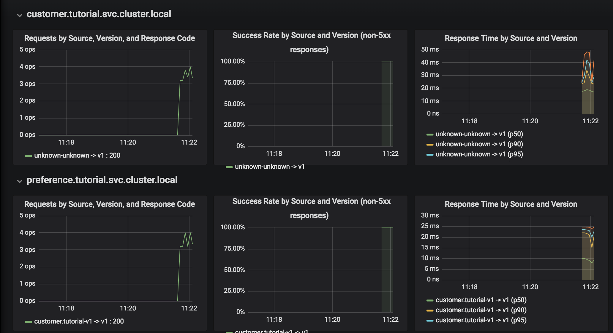

For monitoring, Istio offers out of the box monitoring via Prometheus and Grafana.

## Install Prometheus and Grafana

To make it work, we need first to install [`Prometheus`](https://prometheus.io/) and [`Grafana`](https://grafana.com/). 

Let's go to the istio installation folder.

Execute `cd ~/istio-0.4.0/`{{execute}}

Now we need to apply the following file to the OpenShift instance:

`oc apply -f install/kubernetes/addons/prometheus.yaml -n istio-system`{{execute}}

`oc apply -f install/kubernetes/addons/grafana.yaml -n istio-system`{{execute}}

After the installation of these Istio add-ons, we need to expose the services.

Execute: `oc expose svc prometheus -n istio-system`{{execute}}

and 

`oc expose svc grafana -n istio-system`{{execute}}

Now, let's wait until `grafana` and `prometheus`pod are up and running.

Execute `oc get pods -w -n istio-system`{{execute}} and wait until grafana pod STATUS is `Running`.

Once it's Running, click `CTRL+C` and access Grafana console that is running at http://grafana-istio-system.[[HOST_SUBDOMAIN]]-80-[[KATACODA_HOST]].environments.katacoda.com

At Grafana console, select the Istio Dashboard.

## Try Grafana console

Now let's wait also for the microservices to get deployed.

Execute: `oc get pods -w -n springistio`{{execute}}.

Wait until all microservices READY column show 2/2. Then click `CTRL+C` and perform some calls to the `customer` microservice.

Execute the following command how many times you want: `curl http://customer-springistio.[[HOST_SUBDOMAIN]]-80-[[KATACODA_HOST]].environments.katacoda.com`{{execute}}

Return to http://grafana-istio-system.[[HOST_SUBDOMAIN]]-80-[[KATACODA_HOST]].environments.katacoda.com and refresh the screen.

Note that you can now visualize request information for each microservice

## Custon metrics in Prometheus

Istio also allows you to specify custom metrics which can be seen inside of the Prometheus dashboard

Look at the file https://github.com/redhat-developer-demos/istio_tutorial/blob/master/istiofiles/recommendations_requestcount.yml

It specifies an istio rule that invokes the `recommendationsrequestcounthandler` for every invocation to `recommendations.springistio.svc.cluster.local`

**TODO** Needs more exaplanation about this file

Go to the `istio_tutorial` folder. Execute: `cd ~/istio_tutorial`{{execute}}

Now, add the custom metric and rule.

Execute `oc apply -f istiofiles/recommendations_requestcount.yml -n istio-system`{{execute}}

Open the Prometheus Dashboard at http://prometheus-istio-system.[[HOST_SUBDOMAIN]]-80-[[KATACODA_HOST]].environments.katacoda.com and add the following metric

`round(increase(istio_recommendations_request_count{destination="recommendations.springistio.svc.cluster.local" }[60m]))`

and select `Execute`.

Then run several requests through the system: `curl http://customer-springistio.[[HOST_SUBDOMAIN]]-80-[[KATACODA_HOST]].environments.katacoda.com`{{execute}}

